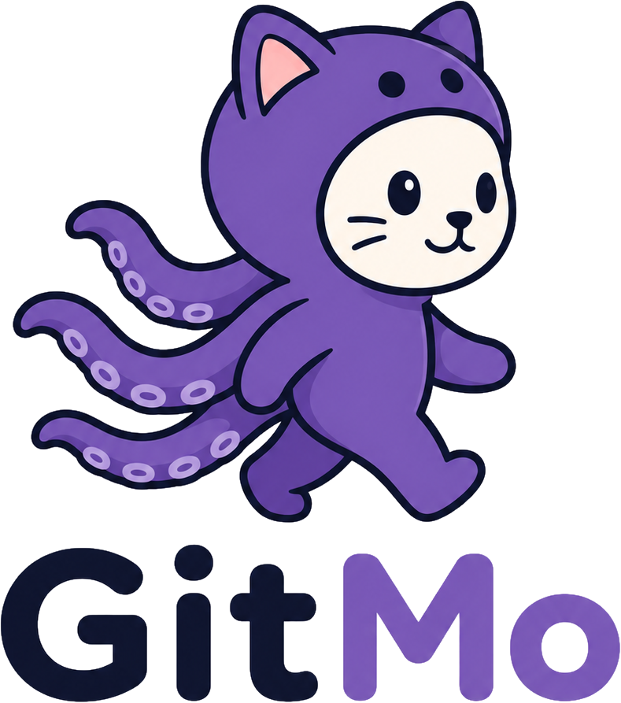

<p align="center">
  
</p>

# GitMo

<p align="center">
  <strong>Automatic GitHub sync for local project folders.</strong>
</p>

**Current version: 0.1.2**

GitMo is a Linux desktop application that connects local project folders to
GitHub repositories. It can create or clone repositories, watch selected
folders, create autosave commits, and synchronize simple personal workflows
without requiring regular terminal use.

GitMo is intended for personal backup and low-conflict projects. It is not a
replacement for a full Git client or a team merge workflow.

## Features

- Choose one main GitMo folder whose direct child folders become repo candidates
- Add folders from elsewhere on the computer without moving them
- Load repositories from the authenticated GitHub account
- Match local folders and GitHub repositories by name
- Create a GitHub repository for a local folder
- Clone a GitHub repository that is missing locally
- Initialize plain local folders as Git repositories
- Add a basic root `README.md` when a newly uploaded folder has none
- Commit local changes with the message `GitMo autosave`
- Support one-way and two-way sync modes
- Detect divergent local and remote history instead of guessing how to merge it
- Run in the background with AppIndicator or GTK tray support when available
- Restore the window by double-clicking the tray icon where supported
- Start automatically with the desktop session
- Display repository status and recent activity on the dashboard
- Search, filter, configure, and delete repositories from Manage Repositories
- Adjust application text size
- Reset all saved GitMo settings from the File menu

## Manage Repositories

Manage Repositories uses one table with these columns:

- `Delete` selects rows for explicit delete operations
- `Name` opens that repository's options
- `GitHub` controls whether the project should exist on GitHub
- `Local Folder` controls whether the project should exist locally

Green checks mean the target is enabled. Red X marks mean it is disabled.
Changing the GitHub or Local Folder target automatically enables sync only when
both targets are selected.

Repositories are displayed in this default order:

1. Repositories that exist on both GitHub and the local computer
2. GitHub-only repositories
3. Local-only folders
4. Remaining configured entries

Names are sorted alphabetically, case-insensitively, inside each group.

The Search box filters by repository name or local path. `Select All (Nuke)`
selects or clears the currently visible rows for delete actions; it does not
directly change the GitHub or Local Folder targets.

The bottom action bar provides:

- `Delete GitHub Repo`
- `Delete Local Folder`
- `Add Local Folder`
- `Cancel`
- `Apply Selection`

Click a repository name to choose one-way or two-way sync. Outside folders also
have a `Remove from Repo List` option that does not delete the folder.

When both GitHub and Local Folder are enabled, the same options window also
provides durable per-project update settings:

- After 1 minute idle (default)
- Every 5 minutes while changing
- Every 10 minutes while changing
- Every 30 minutes while changing
- Manual commits only through `Run Sync Now`

Timed schedules create a commit only when Git detects local changes. `Run Sync
Now` overrides the schedule and commits pending changes immediately.

Per-project commit messages can use:

- A changed-file summary (default)
- `GitMo autosave`
- `GitMo autosave` with the current date and time

## Dashboard

The dashboard shows:

- Whether sync is watching or paused
- The selected GitMo root folder
- The number of enabled repositories
- The active sync mode or mixed-mode status
- Each repository's local path, status, and last sync time
- Recent activity from the GitMo log

The shared ribbon contains:

- `Dashboard` or `Manage Repos`
- `Stop Sync` or `Start Sync`
- `Run in Background`

When GitMo is hidden, double-click its tray icon to restore the window. The
tray menu's `Show GitMo` action remains available on desktops that handle tray
clicks differently. AppIndicator desktops also support middle-click restore
when the desktop exposes secondary activation.

Additional actions are available from the File menu:

- Run Sync Now
- View Logs
- Manage Repos
- Add Local Folder
- Choose GitMo Folder
- View GitHub
- Run in Background
- Start with boot
- Delete all settings and restart
- Exit

## Sync Modes

### One-Way

GitMo watches local changes, creates autosave commits, and pushes them to
GitHub. It fetches remote state but does not pull remote commits. If GitHub is
ahead, GitMo reports a warning.

### Two-Way

GitMo fetches GitHub changes and pulls remote commits only when Git can perform
a fast-forward update. If both local and remote history changed, GitMo reports a
conflict and leaves resolution to the user.

## First Setup

Requirements:

- Linux
- Python 3.10 or newer
- Tkinter
- `git`
- A GitHub personal access token with repository access

Setup:

1. Start GitMo.
2. Enter a GitHub personal access token.
3. Choose or create the main GitMo folder.
4. Open Manage Repositories.
5. Set the GitHub and Local Folder targets for each project.
6. Click a repository name if its sync mode needs changing.
7. Click `Apply Selection`.

GitHub repositories are loaded in a background thread, allowing the interface
to open from saved and local state before the network request completes.

## Common Workflows

### Upload a Local Folder

For a direct child of the GitMo folder, open Manage Repositories and enable both
GitHub and Local Folder.

For a folder elsewhere on disk:

1. Click `Add Local Folder`.
2. Choose the existing folder.
3. Keep GitHub and Local Folder enabled.
4. Click `Apply Selection`.

If no matching GitHub repository exists, GitMo creates one, initializes Git when
needed, creates a root README when missing, commits, and pushes the contents.

### Clone a GitHub Repository

For a GitHub-only row, enable Local Folder and click `Apply Selection`. GitMo
clones it into the configured local path and sets the local Git identity.

### Same Name on Both Sides

GitMo matches projects by repository or folder name.

- If the local folder is already a standalone Git repository, GitMo connects
  its `origin` to the matching GitHub repository.
- If the local folder is empty, GitMo clones the GitHub repository into it.
- If the local folder is non-empty and is not a Git repository, GitMo asks
  before replacing the remote history with the local folder contents.

Only one local folder can be associated with a given GitHub repository name.

## Delete Safety

`Delete GitHub Repo` permanently deletes selected repositories from GitHub but
does not delete local folders.

`Delete Local Folder` permanently deletes selected local folders but does not
delete GitHub repositories.

These dedicated delete actions require confirmation and typing `DELETE`.
Apply Selection also asks for confirmation if the selected target changes would
delete existing local or GitHub data.

The File menu's `Delete all settings and restart` removes the saved token,
selected GitMo folder, repository configuration, UI settings, and autostart
entry. It does not delete local folders or GitHub repositories.

## Run From Source

```bash
python3 app.py
```

Or:

```bash
./run-gitmo.sh
```

The source-tree desktop launcher is `GitMo.desktop`. Some file managers require
the launcher to be marked trusted before opening it.

## Development

The project intentionally uses mostly Python standard-library components:

- `gitmo/app.py` - Tkinter UI, setup, dashboard, repository manager, and tray
- `gitmo/sync_engine.py` - polling, sync decisions, autosave, pull, and push
- `gitmo/git_cli.py` - wrappers around the local `git` executable
- `gitmo/github_api.py` - GitHub REST API client
- `gitmo/config.py` - saved application configuration
- `tests/` - focused unit tests

Run the current checks:

```bash
python3 -m compileall -q app.py gitmo tests
python3 -m unittest discover -s tests -v
python3 -m build --no-isolation
```

## Packaging

Project, Python package, and Debian package metadata currently target version
`0.1.2`.

Build a local package with the lightweight builder:

```bash
./packaging/build-local-deb.sh
```

Build using the Debian packaging:

```bash
dpkg-buildpackage -us -uc -b
```

The Debian package installs:

- The `gitmo` Python package
- The `/usr/bin/gitmo` launcher
- Desktop and AppStream metadata
- Application artwork
- GTK/AppIndicator, notification, Git, Tkinter, and desktop integration
  dependencies

The package is being prepared for local `.deb` use, Launchpad PPA publishing,
and later Ubuntu/Kubuntu software listings.

## App Data

Configuration:

```text
~/.config/gitmo/config.json
```

Activity log:

```text
~/.config/gitmo/gitmo.log
```

Autostart entry:

```text
~/.config/autostart/GitMo.desktop
```

Legacy configuration at `~/.config/gitlo/config.json` is read during migration
from the older application name.

The current release stores the GitHub token in the local JSON configuration and
uses authenticated HTTPS Git remote URLs. Protect the user account and config
directory, use a narrowly scoped token, and revoke any token that may have been
exposed.

## Current Limitations

- Sync uses a polling loop with a 60-second quiet-period debounce.
- Each repository can instead use a 5, 10, or 30 minute update interval, or
  manual-only commits.
- Two-way sync supports fast-forward pulls, not automatic merge resolution.
- Diverged histories require manual Git resolution.
- Repository and folder names are the matching key.
- Tray behavior depends on support provided by the Linux desktop environment.
- GitMo currently targets GitHub and HTTPS authentication.

## License

GitMo is released under the GNU General Public License v3.0 or later. See
`LICENSE` for the full license text.

Maintainer: Kyle Benzle <kbe@gmx.us>

Homepage: <https://github.com/KyleBenzle/GitMo>
